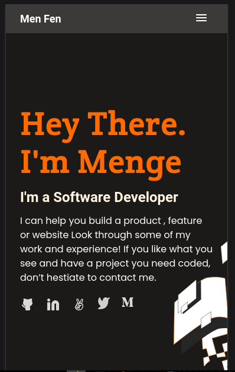
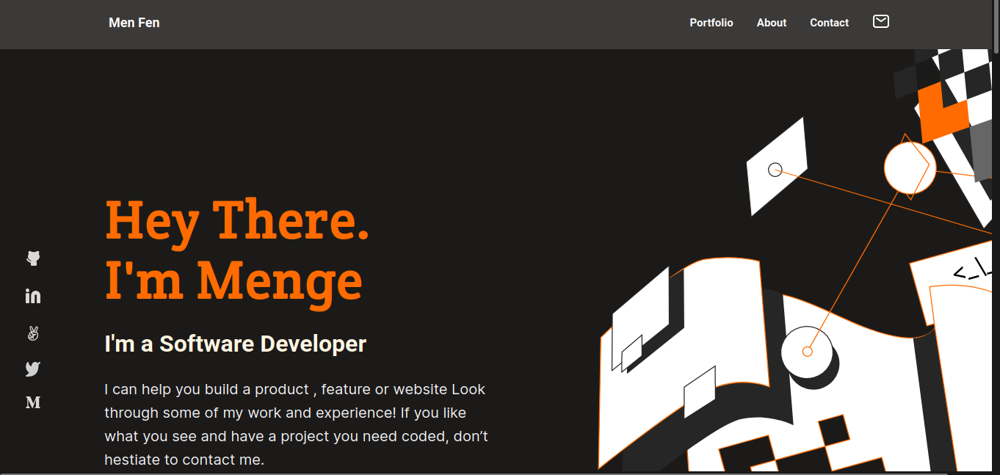

# personal-portfolio

# "Microverse Portfolio" Project

> In this project, the portfolio responsive website has been done using purely HTML and CSS technologies as part of the requirement of Microverse learning. The work is done based on the available reference Figma design file.

## Mobile Version

> All units are from Figma design file: Template-2
> In order to layout components flexbox and CSS Grid are used.

## Desktop Version

> All units and styles are from Figma design file: Template-2
> To layout components flexbox and CSS Grid are used.

## Built With

- HTML
- CSS

## Getting Started

**This is an example of how you may setup linters for htm-css projects.**
**Demonstrate the concept of github flows**

**The the front page has two sections: the header-section and the heading section**

**Flexbox is used to arrange elements in both section**

**The work section part of the projects completed. This has been done for mobile website using Flexbox and CSS Grid.**

**The about-section is done using unorder list elements to showcase the major skills for the personal portfolio website.**

**The form-section consists of the form submission elements with form validation. In addition, the footer social-media navigation implemented.**

**The css media querries used to include responsive web design features fro various screen sizes**

**The form validation feature has been added using JavaScript**

**The websited enables to store the form submission data to local storages**

## Authors

👤 **Author1**

- GitHub: [@mengiefen](https://github.com/githubhandle)
- Twitter: [@MengistuFentaw](https://twitter.com/twitterhandle)
- Linkedin: [LinkedIn](https://www.linkedin.com/in/mengefen/)

## 🤝 Contributing

-Github: [@Estebanmual](https://github.com/Estebanmual)
-Github: Kenny Salazar[@helio3197] (https://github.com/helio3197)

## Show your support

## Acknowledgments

- To my coding partners: Nytare Guy, Ivan Barbosa da Silva,Esyeban Mual.

## Live Demo

- https://mengiefen.github.io/personal-portfolio/

## 📝 License

This project is [MIT](./MIT.md) licensed.
